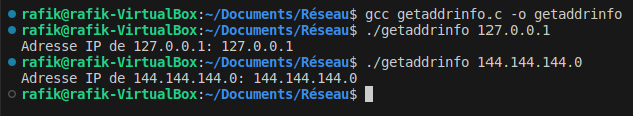
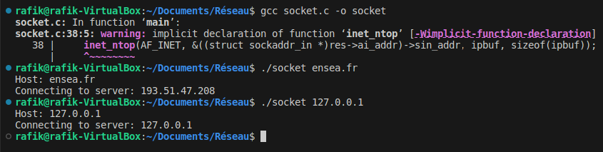
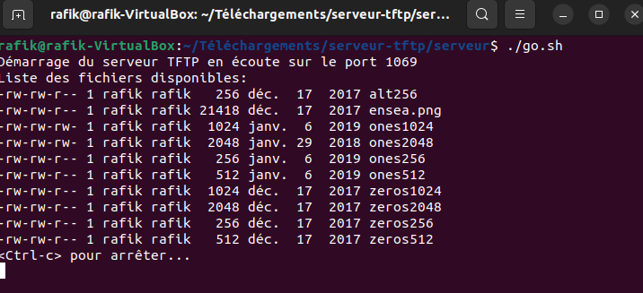
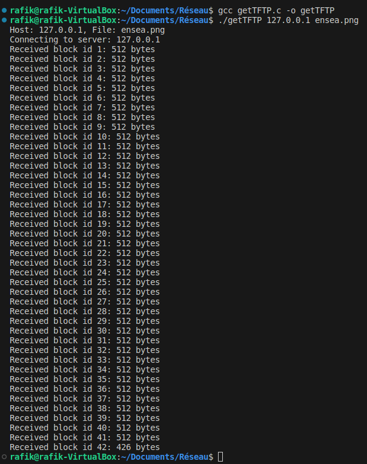
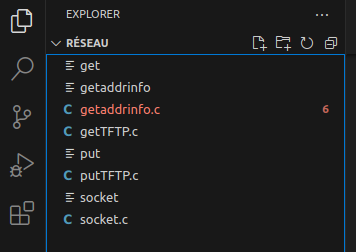
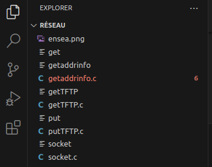
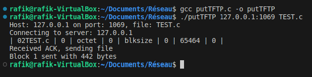
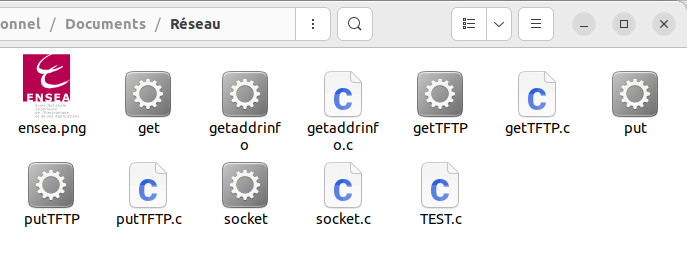

# TP_R-seaux
# Binome : CHAIR & BELKHIR

## 1.  Utilisation de getaddrinfo pour Récupérer l\'Adresse du Serveur :

Le segment de code présent dans le fichier \"ex2.c\" concerne la
création d\'un programme simple. En prenant le nom du serveur comme
argument, ce code utilise la fonction getaddrinfo() afin d\'obtenir
l\'adresse IP correspondante. L\'utilisation de cette fonction revêt une
importance capitale puisqu\'elle permet d\'acquérir des informations
d\'adresse liées à un nom d\'hôte ou une adresse IP donnés. En
conséquence, elle facilite la résolution du nom du serveur en une
adresse IP utilisable.

## 2.  Établissement d\'un Socket de Connexion vers le Serveur :

> Au cours de cette étape, une connexion de socket vers un serveur, à
> une adresse spécifiée, a été réalisée. Ceci a été accompli en
> utilisant la fonction getaddrinfo().\
> \
> 

## 3.  Implémentation de Gettftp :

> Au cours de cette phase, nous avons amorcé le processus en
> introduisant la fonction gettftp. Cette fonction est conçue pour
> rechercher un document sur le serveur et créer une copie locale de
> celui-ci dans notre répertoire. Pour amorcer ce processus, nous avons
> préalablement importé le serveur dans notre machine virtuelle, suivi
> du lancement de l\'objet à l\'aide de la commande ./go.sh.
>
> 
> En adéquation avec les spécifications du protocole TFTP, nous avons
> conçu un paquet RRQ (Read Request) conforme au format requis. Ce
> paquet a ensuite été acheminé vers le serveur en utilisant la fonction
> sendto.
>
> Notre programme s\'engage activement dans la réception du fichier,
> encapsulé dans un unique bloc de données (DAT), tout en orchestrant
> simultanément l\'envoi d\'accusés de réception (ACK). Le contenu du
> fichier reçu est extrait de manière méthodique et préservé localement.
> À la clôture de cette étape, un accusé de réception (ACK) est renvoyé
> au serveur, officialisant ainsi la présence des fichiers dans notre
> répertoire local.
>
> 
>
> 
>
## Explication Code :

### Question 1 - Implémentation de GETTFTP :

Ce code met en œuvre le protocole TFTP (Trivial File Transfer Protocol)
pour le transfert de données du serveur vers le client. Voici le
déroulement du processus :

A.  Paramètres d\'Entrée :

-   Le programme requiert en entrée l\'adresse IP du serveur ainsi que
    le nom du fichier à récupérer.

B.  Configuration du Socket :

-   La structure addrinfo est paramétrée pour obtenir les informations
    d\'adresse du serveur TFTP.

-   La fonction getaddrinfo est utilisée pour récupérer ces informations
    en fonction de l\'adresse IP du serveur et du port 1069, le port
    standard du protocole TFTP.

C.  Création du Socket :

-   La fonction socket est employée pour créer un socket UDP facilitant
    la communication avec le serveur TFTP.

D.  Construction et Envoi de la Demande de Fichier :

-   Le programme élabore un paquet TFTP de type demande de fichier
    (opcode 1) contenant le nom du fichier et le mode de transfert
    (\"octet\").

-   Ce paquet est transmis au serveur grâce à la fonction sendto.

E.  Réception et Écriture des Données du Serveur :

-   Le programme utilise une boucle infinie pour recevoir les données du
    serveur via recvfrom.

-   Après la réception des données, un accusé de réception (ACK) est
    envoyé au serveur pour confirmer la réception du bloc de données.

-   Les données reçues, à l\'exception des 4 premiers octets de
    l\'en-tête, sont écrites dans un fichier local.

-   Gestion des Blocs et Fin du Transfert :

-   Le programme vérifie la correspondance du bloc de données reçu avec
    celui attendu avant de le consigner dans le fichier local.

-   Le transfert se poursuit jusqu\'à ce qu\'un paquet de données reçu
    soit inférieur à 512 octets, indiquant ainsi la fin du transfert.

-   Une fois le transfert accompli, le fichier est fermé, les ressources
    sont libérées et le programme prend fin.

## 4.  PutTFTP : Transmission d\'un Fichier au Serveur :

> Construction d\'une Requête en Écriture (WRQ) et Envoi au Serveur :
>
> La fonction putFile se charge de construire une requête en écriture
> (WRQ) parfaitement formulée, incluant le nom du fichier, le mode
> (\"octet\"), ainsi que la taille du bloc. Cette requête est ensuite
> expédiée au serveur par le biais de la fonction sendto.
>
> Envoi d\'un Fichier en Paquets de Données (DAT) et Réception des
> Acquittements (ACK) :
>
> La fonction prend en charge l\'envoi du fichier sous forme de
> plusieurs paquets de données (DAT) au serveur, tout en attendant les
> acquittements correspondants (ACK). Cette opération est exécutée à
> l\'intérieur d\'une boucle while (1).

Gestion de l\'Envoi Continu de Paquets de Données et Vérification des
Acquittements :

> La boucle while (1) au sein de la fonction putFile supervise l\'envoi
> continu de paquets de données jusqu\'à ce que l\'intégralité du
> fichier soit transférée. Une vérification, commentée (/\*\|\| blockId
> != blockCounter\*/), est intégrée dans le code pour correspondre aux
> acquittements anticipés. Cette mesure assure une synchronisation
> efficace entre l\'émetteur et le destinataire pendant le processus de
> transmission.
>
> 
>
> 
## Explication code :
>
### Question 2 - Implémentation de PUTTFTP :
>
> Ce code met en œuvre le protocole TFTP pour le transfert de données du
> client vers le serveur. Voici le déroulement du processus :
>
> A\. Initialisation du Client :
>
> - Le client crée un socket UDP pour établir une connexion avec le
> serveur en utilisant les fonctions socket() et getaddrinfo() pour
> obtenir les informations d\'adresse du serveur.
>
> B\. Envoi de la Demande d\'Écriture (WRQ) :
>
> - Le client envoie un paquet de demande d\'écriture (WRQ) au serveur
> via sendto(). Ce paquet contient le nom du fichier à écrire et le mode
> de transfert.
>
> C\. Ouverture du Fichier :
>
> - Le client ouvre le fichier à envoyer en mode lecture binaire
> (\"rb\") via fopen().
>
> D\. Préparation et Envoi des Blocs de Données :
>
> - Le client lit des blocs de données du fichier et les transmet au
> serveur sous forme de paquets UDP. Chaque paquet comprend un en-tête
> de 4 octets avec l\'opcode 3 (données) et le numéro de bloc, ainsi que
> les données lues du fichier (maximum 512 octets par paquet).
>
> - Chaque bloc de données est envoyé individuellement au serveur via
> sendto().
>
> E\. Réception des ACK (Accusés de Réception) :
>
> - Après l\'envoi de chaque bloc, le client attend un ACK du serveur
> indiquant la réception réussie du bloc de données. La fonction
> recvfrom() est utilisée pour cette attente.
>
> F\. Contrôle de la Transmission :
>
> - Si le client reçoit un ACK correspondant au numéro de bloc envoyé,
> il transmet le bloc de données suivant. En cas d\'ACK incorrect ou
> manquant, le client réessaie l\'envoi du même bloc.
>
> G\. Fin du Transfert de Fichier :
>
> -  Lorsque le fichier est entièrement envoyé et que le dernier bloc
> est transmis avec succès, le client termine le transfert et ferme le
> fichier.
